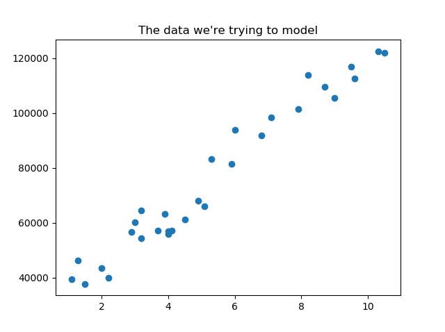
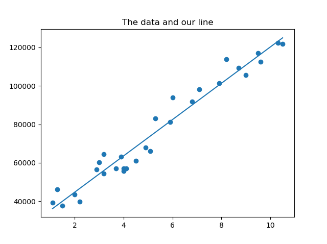

# Simple linear regression with Python, Numpy, Matplotlib
 
Background info / Notes:   
Find a line that models the relationship between a dependent variable and an independent variable.   
 
Equation:   
y = α + b*x   
 
In English: 
y is the dependent variable: what we are trying to predict 
α is a constant: y at x = 0 
b is a coefficient: slope of the line 
x is the independent variable: what we think predicts y   
 
Equation:  
 
 
&nbsp; &nbsp; &nbsp; &nbsp; [SUM(Y) * SUM(X^2)] - [SUM(X) * SUM(XY)]  
α = ________________________________________  
      &nbsp; &nbsp; &nbsp; &nbsp; &nbsp; &nbsp; &nbsp; n[SUM(X^2)] - [SUM(X)]^2 
 
 
&nbsp; &nbsp; &nbsp; &nbsp; n[SUM(XY)] - [SUM(X) * SUM(Y)] 
b = ___________________________________ 
        &nbsp; &nbsp; &nbsp; &nbsp; &nbsp; &nbsp; &nbsp; n[SUM(X^2)] - [SUM(X)]^2 
 
SUM = Summation   
n = sample size
 
 
R-Squared:  
Tells us how good our prediction is, closer to 1 the better.  
Equation:  
 
 
&nbsp; &nbsp; &nbsp; &nbsp; &nbsp; &nbsp; &nbsp; &nbsp; &nbsp; &nbsp; SUM(Y - Yi)^2  
R^2 = 1 - _______________________________ 
&nbsp; &nbsp; &nbsp; &nbsp; &nbsp; &nbsp; &nbsp; &nbsp; &nbsp; &nbsp; SUM(Y - Yavg)^2 
 
Y = the actual data point   
Yi = the predicted Y value   
Yavg = the average Y value   
 
 
Convert the equations to code (we can leverage the numpy dot function for SUM(XY) and SUM(X^2)):   
n = X.size   
sumY = Y.sum()   
sumX = X.sum()   
sumXY = X.dot(Y)   
sumX2 = X.dot(X)   
 
denominator = (n * sumX2) – (sumX ** 2)   
a = ((sumY * sumX2) – (sumX * sumXY)) / denominator   
b = ((n * sumXY) – (sumX * sumY)) / denominator   
 
SSres = Y – predictedY   
SStot = Y – Y.mean()   
rSquared = 1 – (SSres.dot(SSres) / SStot.dot(SStot)) 
 

 

